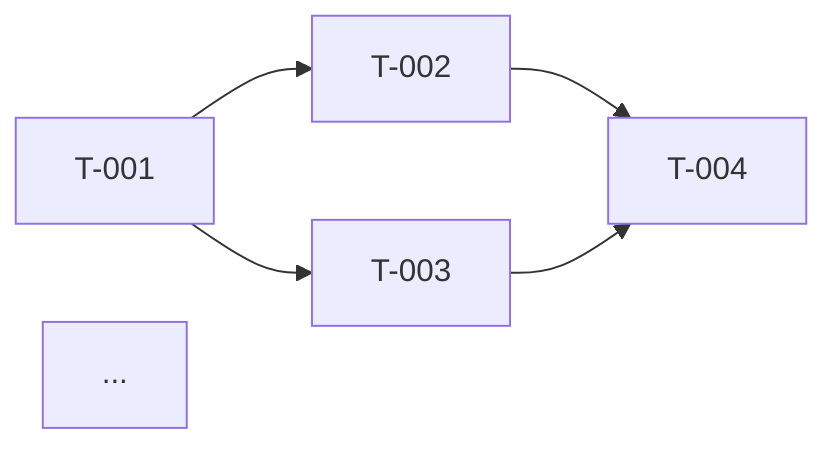

# Methodology: Phase 2: Planning

> Companion to `SKILL.md` in this directory. Loaded on demand by `/phase2-planning`.
> No frontmatter, this file is a methodology reference, not a discoverable skill.

Translate a requirements deliverable into a fully sequenced execution plan.
The output (`plan.md`) is the contract that `/phase3-architecture` and `/phase5-development`
will execute against, every architectural decision must be expressible as a
task, every code commit must close one or more task IDs.

---

## Inputs

The `/phase2-planning` skill reads these from local files before invoking this methodology:

- **Required:** `./phases/phase1-requirements/output/requirements.md`: the requirements deliverable. **Hard-block** if missing.
- **Optional:** module-level requirements docs (if requirements decomposed per-module), glossary, scope statements.
- **Optional:** prior-phase reviewer notes left in `./phases/phase2-planning/inputs/`: the human's comments on the requirements deliverable often shape the plan ("we want to see the auth slice first," "M2 must include the integration with X").

If multiple modules in the project already have plans, read them too, your plan must not duplicate or contradict cross-module sequencing.

---

## Phase 1: Catalog the FRs and NFRs

Read `requirements.md` end-to-end. Build a flat catalog as JSON in working memory:

```json
{
  "frs": [
    { "id": "FR-001", "title": "...", "moscow": "must|should|could|wont", "module": "..." },
    ...
  ],
  "nfrs": [
    { "id": "NFR-PERF-01", "category": "performance|security|a11y|...", "target": "..." },
    ...
  ]
}
```

Two rules:
1. **Preserve the IDs** from `requirements.md` verbatim. Tasks reference these IDs; renaming breaks traceability.
2. **Don't drop `wont` FRs.** Keep them in the catalog with `moscow: "wont"` so they're explicitly in the plan as deferred, silent drops re-surface later as "we thought we agreed to that."

---

## Phase 2: Analysis

### 2.1 Decompose every `must`/`should` FR into tasks

A task is a unit of work that:
- Takes **0.5 to 3 days** (median 1 day). Anything longer must be split. Anything shorter folds into a parent.
- Has a **single owner profile** (`ai`, `human`, `paired`): not a mix.
- Has a **deliverable** that's externally verifiable (a passing test, a deployed endpoint, a signed-off doc), not "did some thinking."
- Cites the **FR ID(s)** it advances.

Default decomposition for a typical FR ("user can do X"):

| Task | Owner | Median |
|------|-------|--------|
| Define API contract for X | paired | 0.5d |
| Design data shape / migration | paired | 0.5d |
| Implement service layer | ai | 1d |
| Implement controller + validation | ai | 0.5d |
| Implement frontend page/component | ai | 1d |
| Wire frontend to API | ai | 0.5d |
| Unit tests (back + front) | ai | 1d |
| Integration test for the flow | ai | 0.5d |
| Accessibility pass | ai | 0.5d |
| Manual verification + screenshots | human | 0.5d |

Adjust the menu per FR, most FRs use a subset, complex ones add tasks (background jobs, real-time updates, third-party integration).

### 2.2 Decompose NFRs into tasks too

NFRs are NOT free, they require explicit work. Examples:

| NFR | Tasks it implies |
|-----|------------------|
| `NFR-SEC-01` ASVS L2 compliance | Security middleware, JWT/CSRF, secure cookies, rate limiting, security tests, blueteam scan run |
| `NFR-PERF-01` p95 < 500ms | Load testing setup, query indexing tasks, caching layer, performance test in CI |
| `NFR-A11Y-01` WCAG 2.1 AA | Axe in CI, manual keyboard test, contrast audit, screen reader smoke test |
| `NFR-PWA-01` Installable | Manifest, service worker, install prompt composable, icon generation |

Don't bury NFR tasks at the end of the plan. Distribute them across milestones so each milestone produces a demonstrable, compliant slice.

### 2.3 Classify owner profile

| Profile | Use when |
|---------|----------|
| `ai` | Code, tests, docs, configuration, scaffolding, CRUD endpoints, UI components, lint/format passes, sync-docs runs |
| `human` | Stakeholder calls, signing/approving, user research recruitment, accessing systems Claude can't (line-of-business apps, ticketing systems with SSO walls), legal/compliance review, production deployment approval |
| `paired` | Architecture decisions, security architecture, UX flows, ambiguous requirements, anything where Claude drafts and a human decides |

**Rule of thumb:** If the task's deliverable is a file (code, test, doc, config), it's `ai` unless judgment is centrally required. If the deliverable is a decision or sign-off, it's `human` or `paired`.

### 2.4 Wire dependencies

A task depends on another iff it **cannot meaningfully start** until that one is complete. Common patterns:

- API contract → service layer → controller → frontend
- Data migration → service layer
- Auth bootstrap → every protected feature
- Integration test → all unit tests in the slice
- Accessibility pass → component implementation

Avoid two anti-patterns:
- **Over-declaring** dependencies serializes the plan and inflates the critical path. Tasks that touch different files in different layers usually CAN run in parallel.
- **Under-declaring** creates broken builds. If task B's tests will fail without task A's migration, declare it.

### 2.5 Group into milestones

Default progression:
- **M1: Foundation**: repo setup, auth, baseline middleware, health checks, one trivial vertical slice end-to-end (proves the architecture works). Demoable.
- **M2: Core domain**: the must-have FRs that are central to the product's value proposition. Demoable to a stakeholder as "this is the product."
- **M3: Integrations**: third-party systems, real-time/background processing, complex flows. Demoable to integration partners.
- **M4: Polish**: should-have FRs, accessibility, performance, PWA, observability, docs. Demoable as "ready to launch."

Each milestone has:
- A 1-line **scope summary** (what's in)
- A **demo statement** (what a stakeholder would see)
- A **target window** (e.g., "Week 2-3"), not a calendar date, calendar dates lie about uncertainty

If a project doesn't fit M1-M4 cleanly, redefine the milestones, but keep the principle: a milestone is a coherent demonstrable slice, not a time-box.

### 2.6 Compute the critical path

Walk the dependency graph end-to-end. The longest path through it (sum of `estimate` along the path) is the critical path. Every day shaved on it shaves a day from delivery; every day added there delays delivery one-for-one. Days off the critical path are slack, useful for risk mitigation, not delivery acceleration.

Report:
- Total critical path length (days)
- The tasks on it (so they're prioritized for paired/AI execution)
- The tasks just barely off it (so a small slip doesn't put them on it)

### 2.7 Risk-load each task

| Risk | Use when | Mitigation requirement |
|------|----------|------------------------|
| `low` | Routine: CRUD, standard middleware, vanilla components | None |
| `medium` | New library, novel UX, unfamiliar API, performance-sensitive | One-line mitigation note |
| `high` | First-time integration, unbounded scope, dependency on third party, security-sensitive | Explicit mitigation paragraph + a "we'll know it's working when..." check |

High-risk tasks are candidates for the prototyping step, get them validated early before committing the rest of the plan to them.

### 2.8 Build the NFR coverage map

For every NFR in the catalog, list the task IDs that advance it. **Every NFR must map to at least one task.** NFRs with zero tasks are silent gaps that re-emerge in production. Call them out in §5 (Open Questions) and either:
- Add tasks to cover the NFR, or
- Document the explicit decision to defer (with target date and risk).

---

## Phase 3: Output structure

Write `plan.md` with this exact skeleton (every phase deliverable in the harness shares §1, §2, §4-§7; only §3 varies per phase):

### 1. Executive Summary

- 3-5 bullets: what's being built, M1-M4 high-level scope, total days estimated, critical path length, headline risk.

### 2. Inputs Consumed

A list of every file read from `./phases/phase1-requirements/output/` (and any reviewer notes in `./phases/phase2-planning/inputs/`), with date/classification/whether the plan cited each. Plus prior-phase notes that shaped scope decisions.

### 3. Plan Body

#### 3.1 Roadmap

Milestone table:

| Milestone | Scope summary (1 line) | Demo statement | Target window | FRs covered |
|-----------|------------------------|----------------|---------------|-------------|
| M1 Foundation | ... | ... | Week 1 | FR-001, FR-014 |
| ... | ... | ... | ... | ... |

#### 3.2 Task Breakdown Structure

The master task table. Sort by milestone, then by sequence:

| Task ID | Milestone | FR/NFR | Description | Owner | Estimate (d) | Depends on | Risk |
|---------|-----------|--------|-------------|-------|--------------|-----------|------|
| T-001 | M1 | FR-001 | Define `POST /auth/login` API contract | paired | 0.5 |: | low |
| T-002 | M1 | FR-001 | Implement auth service | ai | 1 | T-001 | medium |
| ... | ... | ... | ... | ... | ... | ... | ... |

#### 3.3 Dependency Graph



(Group nodes by milestone using `subgraph`.)

#### 3.4 Estimation Summary

Three sub-tables:

**By milestone:**
| Milestone | Tasks | Days | Owner mix (ai/human/paired) |

**By owner profile:**
| Owner | Tasks | Days | % of total |

**By risk:**
| Risk | Tasks | Days |

#### 3.5 Critical Path

- Total length: N days
- Tasks on the path (in order): T-001 → T-002 → T-005 → T-009 → ...
- Near-critical tasks (≤1 day slack): T-007, T-012, ...

#### 3.6 Resource Plan

- AI capacity: total AI-task-days
- Human availability needed: total human-task-days, with a hint for which weeks load is highest
- Paired-task-days: assume both AI and human present
- Concurrency assumption (e.g., "one AI agent + one human at any time" vs "two AI agents in parallel"); adjust calendar accordingly

#### 3.7 NFR Coverage Map

| NFR ID | Title | Task IDs covering it | Coverage status |
|--------|-------|---------------------|-----------------|
| NFR-SEC-01 | ASVS L2 | T-008, T-014, T-027, T-041 | full |
| NFR-PERF-01 | p95 < 500ms | T-022, T-031 | partial: load test missing |
| NFR-PWA-01 | Installable | (none) | **GAP** |

Any GAP rows must also appear in §5.

### 4. Compliance & Standards

State which standards from `.claude/standards/` the plan respects:

| Standard | Plan addresses it via |
|----------|----------------------|
| 01-architecture | Roadmap matches the layered monorepo structure; M1 includes architecture/health-check tasks |
| 02-security | NFR-SEC-* tasks mapped throughout; one task per ASVS chapter relevance |
| 04-testing | Test tasks tied to every feature task; coverage targets explicit per milestone |
| 05-accessibility | A11y pass task per FR with UI; manual keyboard verification in M4 |
| 06-pwa | Manifest, SW, install-prompt tasks scheduled in M4 (or earlier if NFR-PWA is must) |
| 07-architectural-patterns | Stack choice deferred to /phase3-architecture; plan acknowledges chosen pattern from requirements |
| (project-specific design-system standards, if any) | Design-system tasks and a11y patterns called out separately |

Standards not addressed at planning time (e.g., 03-coding-conventions applies during /phase5-development) get a 1-line "deferred to /<phase>" note.

### 5. Open Questions / Risks

Two parts:

**Open questions for the human reviewer**: list each question with the decision deadline (which milestone it must be resolved by). Common categories:
- Scope ambiguity in a specific FR
- NFR target unspecified ("performance must be good" , define p95)
- Integration partner contact unknown
- Compliance scope unconfirmed

**Plan-level risks**: risks to executing the plan itself (not feature risks, which are per-task):
- Capacity assumptions (e.g., "assumes 1 paired-day per week of human availability")
- External dependency timing (e.g., "M3 depends on integration partner credentials by Week 5")
- Unmapped NFRs (cross-reference §3.7 GAPs)

### 6. Handoff Notes

What `/phase3-architecture` will need:

- Confirmed application profile (Simple / BFF / Enterprise)
- The list of integrations to detail in the architecture
- The list of FRs that need data-model attention (especially many-to-many relationships, soft deletes, audit needs)
- Any high-risk tasks that should be validated by a prototyping spike before committing the plan

What `/phase5-development` will need (later, but flag now):

- Milestone-by-milestone scope so the build sequence aligns
- Test-coverage targets per milestone
- The standards each milestone must satisfy before being declared "complete"

### 7. Appendix: Source Doc Traceability

Mapping every plan element back to its requirements source:

| Plan element | Requirements source |
|--------------|---------------------|
| FR-001 catalog | requirements.md §4.1 |
| NFR-PERF-01 task T-022 | requirements.md §5.2 |
| M3 scope | requirements.md §6 (Module C) |
| ... | ... |

---

## Quality bar

The plan is good when:
- Every must-have FR has at least one task; no orphan FRs.
- Every NFR has at least one task or an explicit deferral.
- Every task is between 0.5d and 3d, has an owner, and cites an FR/NFR.
- The dependency graph has no cycles (run a topological sort to verify).
- The critical path is identified and explicitly listed.
- Every Open Question has a decision deadline.
- A reviewer who only reads §1 understands the shape; one who reads §1+§3.1 can sanity-check the plan; one who reads §3.2+§3.3 can audit it.

The plan is bad when:
- "Build feature X" is one task with no decomposition.
- Owner is "TBD" or "team."
- Dependencies are vibes ("after auth is done, do everything else").
- NFRs aren't mentioned in the body (they show up only in compliance §4, that's a tell that they'll never be implemented).
