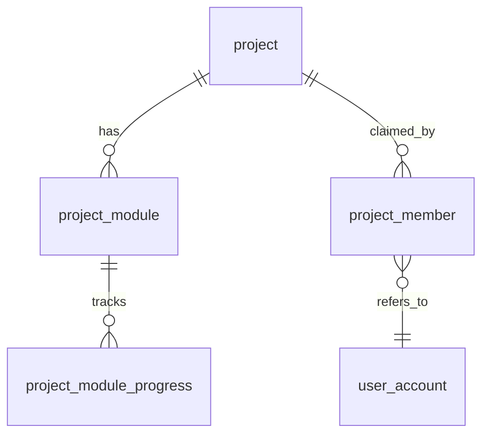
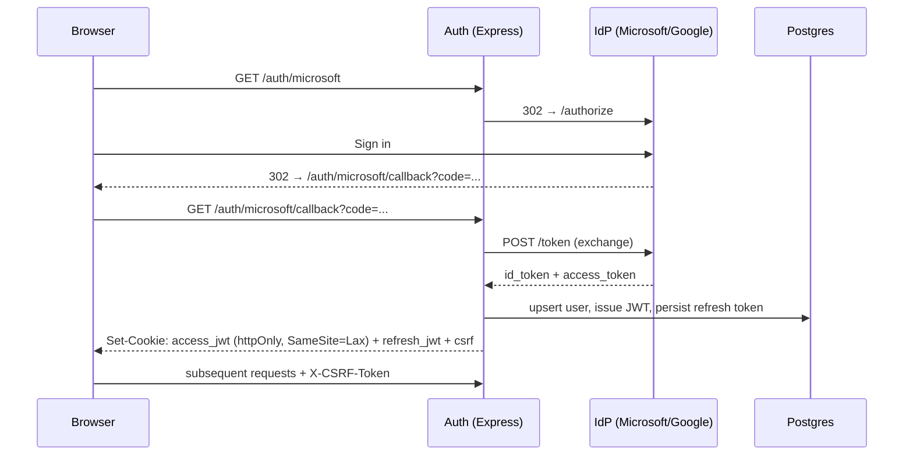
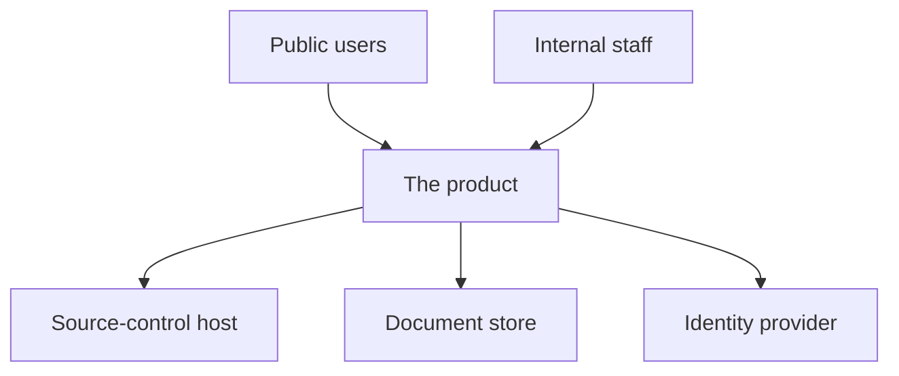

# Methodology: Phase 3: Architecture

> Companion to `SKILL.md` in this directory. Loaded on demand by `/phase3-architecture`.
> No frontmatter, this file is a methodology reference, not a discoverable skill.

Translate a requirements deliverable + an execution plan into a structured
architectural design. The output (`architecture.md` + ADRs) is the contract
that `/phase4-prototyping` validates and `/phase5-development` builds against. Every code
file and migration in development must trace to a component or entity
described here.

---

## Inputs

The `/phase3-architecture` skill reads these from local files before invoking this methodology:

- **Required:** `./phases/phase1-requirements/output/requirements.md`: FRs, NFRs, application profile.
- **Required:** `./phases/phase2-planning/output/plan.md`: task IDs, milestones, dependency graph, NFR coverage map.
- **Optional:** linked source-control repo file listing, an existing repo constrains the architecture.
- **Optional:** prior architecture artifacts from sibling modules in the same project, must be coherent across modules.

If either required input is missing, /phase3-architecture hard-blocks. Do not invent.

---

## Phase 1: Re-establish constraints

Before designing anything, re-read the requirements and plan and write down:

1. **The application pattern** (Simple / BFF / Enterprise): selected in requirements §3 (Application Profile). Match it. If you have grounds to change it, raise that in §5 Open Questions of the architecture doc, don't silently substitute.
2. **The hosting platform**: cloud (Azure, AWS, GCP) or on-prem. Affects every deployment decision downstream.
3. **The SSO requirement**: public-facing (multiple IdPs for any user) vs internal (single-tenant). Affects auth flow.
4. **Required integrations**: identity providers, ticketing systems, document stores, source-control hosts, etc. Each becomes a component.
5. **NFR targets**: performance (p95, throughput), security (ASVS L2 vs L3), accessibility (WCAG 2.1 AA), PWA (must/should/could/wont), availability (uptime SLO).
6. **What `template/` actually provides:**

| Template path | Provides |
|---------------|----------|
| `template/generic/client/` | Vue 3 + PrimeVue + Tailwind, FormKit, Pinia, axios, DOMPurify, useTheme, usePwa |
| `template/<project-skin>/client/` | Vue 3 + project-specific design system, FormKit theme, design-system mobile-nav workaround |
| `template/<project-skin>/server/` | Express + TS, JWT/CSRF/refresh middleware, Postgres + migrations, OAuth2 providers, PAT-injecting source-control client, document-store client, AppError taxonomy, audit logging, file upload with magic-byte validation |

Stack outside this list needs an ADR justifying it AND a follow-up to add it to `template/` so future projects benefit.

---

## Phase 2: Design

### 2.1 Component decomposition

For each FR cluster in `requirements.md`, identify which component owns it. A component is a deployable, scalable unit (a service, a queue, a database, a frontend app). Default decomposition for an Enterprise pattern:

| Component | Responsibilities | Owns FRs |
|-----------|------------------|----------|
| Web (Vue 3) | UI, routing, client-side state, forms, a11y | FR-001, FR-002, ... |
| API (Express) | Auth, request validation, business orchestration, RBAC | FR-* protected operations |
| Auth | OAuth2 callback, JWT issuance, refresh rotation, CSRF | FR-AUTH-* |
| Domain services | Business logic, audit logging, audit trails | per-domain FRs |
| Data (Postgres) | Persistence, ACID, soft deletes, audit columns | data-bearing FRs |
| Object store (BYTEA or blob) | File storage with magic-byte validation | FR-FILES-* |
| Integrations | Source-control host (PAT-injected), document store, optional ticketing / line-of-business systems | FR-INTEG-* |
| Background workers | AI shadow processing, email, async jobs | FR-ASYNC-* |
| Observability | Structured logs, health endpoints, metrics | NFR-OBS-* |

Every FR must be owned by exactly one component. FRs with no clear owner are design gaps, call out in §5.

### 2.2 Data model

For every entity:

- **Name** (snake_case singular: `project`, `project_module`, `project_member`)
- **Primary key** (`pk_<entity>` UUID)
- **Foreign keys** (`fk_<parent_entity>` UUID, ON DELETE behavior explicit)
- **Audit columns**: `created_at`, `created_by`, `updated_at`, `updated_by`, `deleted_at` (for soft delete)
- **Revision column** if multi-agent concurrency applies (e.g., `<entity>_revision INT NOT NULL DEFAULT 1` with auto-bump trigger)
- **Indexes**: on every FK and any column used in `WHERE` of frequent queries
- **Unique constraints**: name and natural-key uniqueness
- **Migration ordering**: note which migration number creates the entity; align with plan milestones

Render as an ERD using mermaid:



### 2.3 API contract sketch

List every endpoint. This is the seed for `openapi.yaml` later , `/development` expands these into full request/response schemas.

```
GET    /projects                        list (paginated)
POST   /projects                        create; admin only
GET    /projects/{id}                   detail (membership-aware)
PATCH  /projects/{id}                   update; owner or open
DELETE /projects/{id}                   soft delete; owner

GET    /projects/{id}/permissions       canX boolean object
POST   /projects/{id}/clone             clone (single-level)
POST   /projects/{id}/lock              acquire lock
POST   /projects/{id}/release-lock      release (force=true for admin)
... etc
```

For each endpoint, note:
- Auth requirement (`public`, `authenticated`, `role:<role>`, `member`)
- CSRF (`yes` for state-changing routes)
- Optimistic-concurrency header expected (`yes` for project-scoped writes; if applicable)
- Retry-safe / idempotent (`yes` for state-changing routes that can be safely retried)
- Rate limit class

This becomes a table in §3.4 of the output doc.

### 2.4 Auth flow

Sequence diagram for the SSO + JWT + refresh + CSRF lifecycle. For OAuth2 (Microsoft / Google):



State the cookie attributes explicitly: `httpOnly`, `Secure`, `SameSite=Lax|Strict`, lifetime, refresh-rotation policy.

### 2.5 Deployment topology

Describe what runs where, what talks to what, where secrets live.

```
                          ┌──────────────────────┐
                          │  Azure Front Door    │
                          └─────────┬────────────┘
                                    │ HTTPS
                          ┌─────────▼────────────┐
                          │ App Service (Linux)  │  Express API (Node 22)
                          │ env: prod / staging  │  + static client (Vite build)
                          └─────────┬────────────┘
                                    │
            ┌───────────────────────┼─────────────────────────┐
            │                       │                         │
   ┌────────▼────────┐    ┌─────────▼─────────┐    ┌──────────▼──────────┐
   │ Azure Database  │    │ Azure Key Vault   │    │ Microsoft Graph     │
   │ for PostgreSQL  │    │ secrets, OAuth    │    │ (document store)    │
   │ Flexible Server │    │ creds, JWT keys   │    │                     │
   └─────────────────┘    └───────────────────┘    └─────────────────────┘
```

State explicitly:
- Where each secret comes from (Key Vault, env var, file mount)
- Network rules (private endpoints? VNet integration?)
- Backup + retention policy for the data store
- Scaling model (auto-scale on CPU? scheduled? fixed?)
- Health probe configuration (which endpoint, expected response, interval)

### 2.6 Tech stack

For every component, declare what it is, why it was chosen, and which template directory provides it.

| Component | Library/Runtime | Rationale | Template path |
|-----------|-----------------|-----------|---------------|
| Web | Vue 3 + Vite + TS | Reactive, wide npm support, design-system interop | `template/<project-skin>/client/` |
| Web UI library | (project-chosen design system) | Brand-compliant; matches product audience | `template/<project-skin>/client/` |
| Forms | FormKit | Schema-driven; integrates with most design systems | both client templates |
| State | Pinia | Composable, devtools, lightweight | both client templates |
| API | Express + TS | Mature, wide npm support, simple to scale | `template/<project-skin>/server/` |
| Auth middleware | Custom (JWT + CSRF) | Already exists in template, audited | `template/<project-skin>/server/` |
| ORM/SQL | Parameterized queries (no ORM) | Avoids ORM injection class; Postgres-native features (JSONB, triggers) | `template/<project-skin>/server/` |
| DB | Postgres 16 | ACID, JSONB, RLS-ready | (managed Postgres of the chosen hosting provider) |
| Object store | Postgres BYTEA | Single backup story; magic-byte validated | `template/<project-skin>/server/` |
| Background workers | Same Express process or a separate service | Avoid Redis until proven necessary | (template extension) |

Anything not in `template/` requires an ADR. Example justifications that earn an ADR:

- "Adding `bullmq` for job queues because the plan has FR-ASYNC-* with strict retry semantics that in-process workers can't deliver." (And follow-up: add a worker template to `template/`.)
- "Replacing FormKit with vee-validate because the chosen design-system interop introduces N hours of work the project can't afford." (Probably wrong, go re-read FormKit theme docs first.)

### 2.7 Architectural Decision Records (ADRs)

Write one ADR per major decision. ADRs live in `architecture/output/adrs/ADR-NNN-<slug>.md`. Template:

```markdown
# ADR-NNN: <Decision title>

- Status: proposed | accepted | deprecated | superseded by ADR-MMM
- Date: YYYY-MM-DD
- Deciders: @<owner>, paired

## Context

What is the issue we're seeing that motivates this decision? Reference the FRs/NFRs/plan milestones that demand a decision here.

## Decision

What did we decide? State it in one sentence at the top, then expand.

## Consequences

- Positive consequences (the benefit)
- Negative consequences (the cost)
- Risks (what could go wrong because of this)
- Follow-ups required (e.g., add to `template/`, update standards)

## Alternatives considered

- Alternative A; why rejected
- Alternative B; why rejected

## References

- ADR-MMM (related)
- requirements.md §X
- plan.md §Y
```

Default ADRs every project should have:

| ADR | Topic |
|-----|-------|
| ADR-001 | Application pattern (Simple/BFF/Enterprise) |
| ADR-002 | Primary data store (Postgres flavor and version) |
| ADR-003 | Auth strategy (SSO providers, JWT lifecycle, CSRF approach) |
| ADR-004 | File storage strategy (BYTEA vs blob) |
| ADR-005 | Background processing (in-process vs separate worker; queue if any) |
| ADR-006 | Frontend component library (project design system vs PrimeVue vs other) |

Plus one ADR per non-obvious choice surfaced during 2.6.

### 2.8 NFR-to-component mapping

For every NFR, list which component owns it.

| NFR ID | Title | Owning component(s) | Implementation note |
|--------|-------|---------------------|---------------------|
| NFR-SEC-01 | ASVS L2 | API + Auth | All ASVS L2 checklists in §02-security; blueteam scan in CI |
| NFR-PERF-01 | p95 < 500ms | API + Data | Index on every FK; query plan check in CI for top 10 queries |
| NFR-A11Y-01 | WCAG 2.1 AA | Web | Axe in CI; manual keyboard test before each release |
| NFR-PWA-01 | Installable | Web | usePwa composable; manifest; service worker |

NFRs unmapped here = §5 Open Question entries.

### 2.9 Threat model (STRIDE-lite)

For each major component or trust boundary, list one threat per STRIDE category and a mitigation. STRIDE-lite means: don't try to enumerate every possible threat, pick the most credible one per category and document it.

| Component | Threat | Category | Mitigation |
|-----------|--------|----------|------------|
| Auth | Token theft from XSS | Spoofing | httpOnly cookies; CSP nonce; DOMPurify on user content |
| API | SQL injection | Tampering | Parameterized queries only; lint ban on string concat in SQL |
| File upload | Malicious file disguised by extension | Tampering | Magic-byte validation; UUID rename; antivirus on upload |
| Audit log | Forensic gap | Repudiation | Audit table append-only; user_id + timestamp + action on every mutation |
| API responses | Leaking other users' data | Information disclosure | Membership check before every project read; explicit field allowlist on serialize |
| Login endpoint | Brute force | Denial of service | Rate limit + account lockout (5 fails / 15 min) |
| API | Privilege escalation via mass-assignment | Elevation of privilege | Zod allowlist on every request body; reject unknown keys |

Trust boundaries to consider:
- Browser ↔ API
- API ↔ Database
- API ↔ Third-party (source-control host, document store, IdP)
- Worker ↔ Queue ↔ API

### 2.10 Coherence check

Before declaring the design done, walk through:

- Every FR has an owning component.
- Every NFR has an owning component.
- Every endpoint in §3.4 traces to an FR.
- Every entity in §3.3 traces to an FR or to audit/cross-cutting concerns.
- Every component in §3.2 has at least one FR or NFR; otherwise it's gold-plating.
- Tech stack lines up with `template/`; divergences each have an ADR.
- Threat model has at least one mitigation per credible threat.
- Plan milestones can actually deliver this architecture incrementally (M1 should not require all of §3.5 deployment topology to exist, use feature flags / staging env if needed).

---

## Phase 3: Output structure

Write `architecture.md` with the standard 7-section skeleton. ADRs are separate files alongside it in `./phases/phase3-architecture/output/adrs/`.

### 1. Executive Summary

3-5 bullets: the chosen pattern, the headline architectural choice (e.g., "Postgres-only state; no Redis"), the hosting platform, the auth approach, the top architectural risk.

### 2. Inputs Consumed

Same format as planning §2. List every file read from `./phases/phase1-requirements/output/` and `./phases/phase2-planning/output/` (and any reviewer notes left in `./phases/phase3-architecture/inputs/`) with classification, plus prior-phase notes that shaped decisions.

### 3. Architecture Body

#### 3.1 System Context

Mermaid diagram showing this system, its users, and the external systems it integrates with.



Plus a 1-paragraph description of the system's purpose for the reader who skipped the requirements doc.

#### 3.2 Component Diagram

Mermaid diagram showing internal components and their relationships, plus a table mapping component → responsibilities → FRs owned.

#### 3.3 Data Model

ERD (mermaid) plus an entity table listing name/PK/FK/audit columns/indexes/originating migration.

#### 3.4 API Contract Sketch

The endpoint table from Phase 2.3.

#### 3.5 Auth Flow

The sequence diagram from Phase 2.4 plus cookie/token attributes.

#### 3.6 Deployment Topology

The diagram from Phase 2.5 plus the explicit declarations (secret sources, network rules, backups, scaling, health probes).

#### 3.7 Tech Stack

The table from Phase 2.6.

#### 3.8 Architectural Decision Records

A 1-row-per-ADR index table:

| ADR | Title | Status | Path |
|-----|-------|--------|------|
| ADR-001 | Application pattern | accepted | `adrs/ADR-001-application-pattern.md` |
| ADR-002 | Postgres 16 as data store | accepted | `adrs/ADR-002-postgres.md` |
| ... | ... | ... | ... |

Each ADR is its own file; this table just lists them.

#### 3.9 NFR Coverage Map

The mapping from Phase 2.8.

#### 3.10 Threat Model

The STRIDE-lite table from Phase 2.9.

### 4. Compliance & Standards

Which standards from `.claude/standards/` the architecture explicitly addresses:

| Standard | Architecture addresses it via |
|----------|-------------------------------|
| 01-architecture | Layer separation in §3.2 components; health checks in §3.6 |
| 02-security | Auth flow §3.5; threat model §3.10; cookie attributes; rate limit class on every endpoint |
| 04-testing | Component decomposition supports testability (DI on services); CI gates declared |
| 05-accessibility | WCAG 2.1 AA owned by Web component; Axe in CI declared |
| 06-pwa | Manifest, SW, install prompt scoped to Web component (only if NFR-PWA is must/should) |
| 07-architectural-patterns | Pattern selection matches requirements; deviation documented in ADR-001 |
| (project design-system standard, if any) | Brand fonts, mobile-nav workaround, CSP |

Standards explicitly **not** addressed at architecture time and deferred to which step:
- 03-coding-conventions → `/phase5-development`
- Performance load testing → `/phase5-development` (M4)
- Disaster recovery resilience → `/phase8-deployment`

### 5. Open Questions / Risks

**Open questions for the human reviewer** with decision deadlines:
- Pattern deviations from requirements (if any)
- NFRs unmapped to a component (gaps from §3.9)
- Tech-stack divergences from `template/`
- Integration partner specifics still unknown

**Architectural risks** (separate from feature/plan risks):
- Vendor lock-in concerns
- Scaling cliff predictions ("works to N users; redesign needed beyond")
- Compliance gaps (e.g., data residency requirements unclear)

### 6. Handoff Notes

What `/phase4-prototyping` will need:
- The riskiest architectural assumption to validate (e.g., "the integration with X works under our auth model")
- The thinnest end-to-end slice that exercises the headline architectural choice
- A list of cuts allowed for the prototype (no styling polish, mocked external services, partial error handling)

What `/phase5-development` will need:
- This document + ADRs as the source of truth
- The endpoint table from §3.4 expanded into `openapi.yaml` per FR
- Migration sequencing per §3.3, aligned to plan milestones
- The threat-model mitigations as concrete tasks (where they aren't already in plan)

### 7. Appendix: Source Doc Traceability

| Architecture element | Requirements / plan source |
|---------------------|------------------------------|
| Component "Auth" | requirements.md §4 (FR-AUTH-*); plan.md M1 |
| Entity `project_member` | requirements.md §6 (multi-user collaboration) |
| ADR-002 Postgres choice | requirements.md §3 (Application Profile: Enterprise) |
| Threat "API SQL injection" | requirements.md §5 (NFR-SEC-01 ASVS L2) |
| ... | ... |

---

## Quality bar

The architecture is good when:
- Pattern selection matches the requirements pattern (or has an ADR explaining the change).
- Every FR maps to a component, every NFR maps to a component.
- Every endpoint in §3.4 traces to an FR.
- Every entity in §3.3 has its migration number called out, aligned with plan milestones.
- Tech stack divergences from `template/` each have an ADR.
- ADRs cover the headline decisions; each captures Decision/Consequences/Alternatives.
- A reviewer who only reads §1 understands the shape.
- A developer who reads §3.2-3.7 can start `/phase4-prototyping` without further questions for most of the design.

The architecture is bad when:
- Components are vague ("frontend," "backend") with no FRs assigned.
- Endpoint list doesn't match the FRs (extra endpoints = gold-plating; missing endpoints = work hidden).
- Tech stack is "industry standard" with no rationale.
- ADRs say "we'll figure it out later."
- Threat model is "we'll do security."
- The doc and the plan disagree on milestones.
